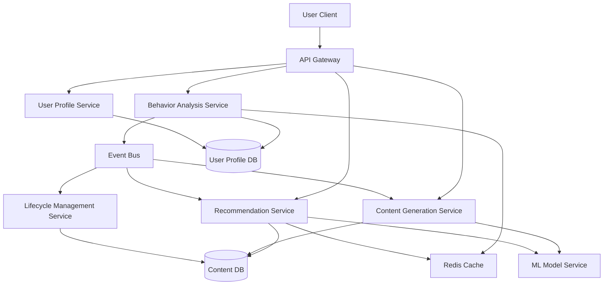

# Design Document: AI-Powered Personalized Content Platform

## Overview

The AI-powered personalized content platform is built on a microservices architecture that separates concerns between user behavior analysis, content generation, recommendation serving, and content lifecycle management. The system uses machine learning models for personalization and content generation, with a real-time event-driven architecture for capturing and processing user interactions.

The platform consists of five core services:
1. **Behavior Analysis Service** - Processes user interactions and builds behavior patterns
2. **Content Generation Service** - Creates personalized content using AI models
3. **Recommendation Service** - Generates and serves personalized content recommendations
4. **Lifecycle Management Service** - Manages content through its lifecycle stages
5. **User Profile Service** - Maintains and serves user profile data

## Architecture

### High-Level Architecture



### Service Communication

Services communicate through:
- **Synchronous**: REST APIs for client-facing operations
- **Asynchronous**: Event bus (Kafka/RabbitMQ) for inter-service communication
- **Caching**: Redis for frequently accessed data (user profiles, recommendations)

### Data Flow

1. User interactions flow through API Gateway to Behavior Analysis Service
2. Behavior Analysis Service publishes events to Event Bus
3. Recommendation Service and Content Generation Service consume events to update models
4. Lifecycle Management Service monitors content metrics and updates status
5. All services read/write to appropriate data stores with caching layer

## Components and Interfaces

### 1. Behavior Analysis Service

**Responsibilities:**
- Capture and store user interactions
- Analyze interaction patterns
- Update user behavior profiles
- Publish behavior change events

**Key Interfaces:**

```typescript
interface BehaviorAnalysisService {
  recordInteraction(interaction: UserInteraction): Promise<void>
  getBehaviorPattern(userId: string): Promise<BehaviorPattern>
  updateBehaviorProfile(userId: string): Promise<void>
}

interface UserInteraction {
  userId: string
  contentId: string
  interactionType: 'view' | 'like' | 'share' | 'comment' | 'skip'
  timestamp: Date
  duration: number  // seconds
  metadata: Record<string, any>
}

interface BehaviorPattern {
  userId: string
  preferenceCategories: CategoryPreference[]
  interactionFrequency: number
  averageDuration: number
  topAttributes: ContentAttribute[]
  lastUpdated: Date
}

interface CategoryPreference {
  category: string
  score: number  // 0.0 to 1.0
  interactionCount: number
}
```

**Implementation Details:**
- Uses sliding window algorithm for 30-day pattern analysis
- Implements exponential decay for older interactions
- Batch processes behavior updates every 5 seconds
- Publishes `BehaviorUpdated` events to Event Bus

### 2. Content Generation Service

**Responsibilities:**
- Generate personalized content using AI models
- Validate content quality
- Store generated content
- Schedule content generation jobs

**Key Interfaces:**

```typescript
interface ContentGenerationService {
  generateContent(userId: string, preferences: BehaviorPattern): Promise<Content>
  validateContent(content: Content): Promise<QualityScore>
  scheduleGeneration(userId: string, schedule: Schedule): Promise<void>
}

interface Content {
  id: string
  userId: string
  type: 'text' | 'image' | 'video' | 'multimedia'
  data: any
  attributes: ContentAttribute[]
  qualityScore: number
  createdAt: Date
  status: 'active' | 'archived' | 'deleted'
}

interface ContentAttribute {
  name: string
  value: string
  weight: number
}

interface QualityScore {
  overall: number  // 0.0 to 1.0
  coherence: number
  relevance: number
  originality: number
}
```

**Implementation Details:**
- Integrates with ML Model Service for content generation
- Uses GPT-based models for text, diffusion models for images
- Implements retry logic with exponential backoff (3 attempts)
- Quality validation runs before content publication
- Daily batch job generates content for active users

### 3. Recommendation Service

**Responsibilities:**
- Generate personalized recommendations
- Rank content by relevance
- Serve recommendation lists
- Implement diversity algorithms

**Key Interfaces:**

```typescript
interface RecommendationService {
  getRecommendations(userId: string, count: number): Promise<Recommendation[]>
  calculateRelevance(userId: string, contentId: string): Promise<number>
  refreshRecommendations(userId: string): Promise<void>
}

interface Recommendation {
  contentId: string
  relevanceScore: number
  diversityCategory: string
  reason: string
}

interface RecommendationEngine {
  rank(content: Content[], pattern: BehaviorPattern): Recommendation[]
  applyDiversityFilter(recommendations: Recommendation[], diversityPercent: number): Recommendation[]
}
```

**Implementation Details:**
- Uses collaborative filtering + content-based filtering hybrid approach
- Implements diversity algorithm: ensures 20-30% content outside primary categories
- Caches recommendations in Redis with 5-minute TTL
- Excludes already-consumed content using bloom filter
- Fallback to popularity-based recommendations for new users

### 4. Lifecycle Management Service

**Responsibilities:**
- Monitor content engagement metrics
- Update content lifecycle status
- Archive inactive content
- Clean up deleted content

**Key Interfaces:**

```typescript
interface LifecycleManagementService {
  evaluateContentStatus(contentId: string): Promise<LifecycleStatus>
  archiveInactiveContent(): Promise<number>
  deleteExpiredContent(): Promise<number>
}

interface LifecycleStatus {
  contentId: string
  status: 'active' | 'archived' | 'deleted'
  lastInteraction: Date
  interactionCount: number
  daysSinceLastInteraction: number
}
```

**Implementation Details:**
- Runs daily cron job at midnight UTC
- Archives content with no interactions for 90+ days
- Deletes content marked for deletion after 30-day grace period
- Updates content status atomically to prevent race conditions

### 5. User Profile Service

**Responsibilities:**
- Manage user profile CRUD operations
- Persist profile updates
- Handle profile deletion requests
- Enforce data retention policies

**Key Interfaces:**

```typescript
interface UserProfileService {
  createProfile(userId: string): Promise<UserProfile>
  getProfile(userId: string): Promise<UserProfile>
  updateProfile(userId: string, updates: Partial<UserProfile>): Promise<UserProfile>
  deleteProfile(userId: string): Promise<void>
}

interface UserProfile {
  userId: string
  explicitPreferences: Preference[]
  behaviorPattern: BehaviorPattern
  interactionHistory: UserInteraction[]
  createdAt: Date
  updatedAt: Date
  diversitySettings: DiversitySettings
}

interface DiversitySettings {
  enabled: boolean
  percentage: number  // 20-50
  categories: string[]
}
```

**Implementation Details:**
- Stores profiles in PostgreSQL with JSONB for flexible schema
- Implements write-through cache for profile updates
- Maintains 365-day interaction history with automatic pruning
- Handles GDPR deletion requests with 30-day processing window

## Data Models

### Database Schema

**User Profiles Table (PostgreSQL)**
```sql
CREATE TABLE user_profiles (
  user_id VARCHAR(255) PRIMARY KEY,
  explicit_preferences JSONB,
  behavior_pattern JSONB,
  diversity_settings JSONB,
  created_at TIMESTAMP NOT NULL,
  updated_at TIMESTAMP NOT NULL,
  INDEX idx_updated_at (updated_at)
);

CREATE TABLE user_interactions (
  id BIGSERIAL PRIMARY KEY,
  user_id VARCHAR(255) NOT NULL,
  content_id VARCHAR(255) NOT NULL,
  interaction_type VARCHAR(50) NOT NULL,
  timestamp TIMESTAMP NOT NULL,
  duration INTEGER,
  metadata JSONB,
  INDEX idx_user_timestamp (user_id, timestamp DESC),
  INDEX idx_content_timestamp (content_id, timestamp DESC)
);
```

**Content Table (PostgreSQL)**
```sql
CREATE TABLE content (
  id VARCHAR(255) PRIMARY KEY,
  user_id VARCHAR(255),
  type VARCHAR(50) NOT NULL,
  data JSONB NOT NULL,
  attributes JSONB,
  quality_score DECIMAL(3,2),
  status VARCHAR(50) NOT NULL,
  created_at TIMESTAMP NOT NULL,
  last_interaction_at TIMESTAMP,
  interaction_count INTEGER DEFAULT 0,
  INDEX idx_status_last_interaction (status, last_interaction_at),
  INDEX idx_user_created (user_id, created_at DESC)
);
```

### Event Schemas

**BehaviorUpdated Event**
```typescript
interface BehaviorUpdatedEvent {
  eventType: 'BehaviorUpdated'
  userId: string
  timestamp: Date
  changes: {
    preferenceCategories: CategoryPreference[]
    topAttributes: ContentAttribute[]
  }
}
```

**ContentGenerated Event**
```typescript
interface ContentGeneratedEvent {
  eventType: 'ContentGenerated'
  contentId: string
  userId: string
  timestamp: Date
  qualityScore: number
}
```

## Correctness Properties

*A property is a characteristic or behavior that should hold true across all valid executions of a system—essentially, a formal statement about what the system should do. Properties serve as the bridge between human-readable specifications and machine-verifiable correctness guarantees.*

